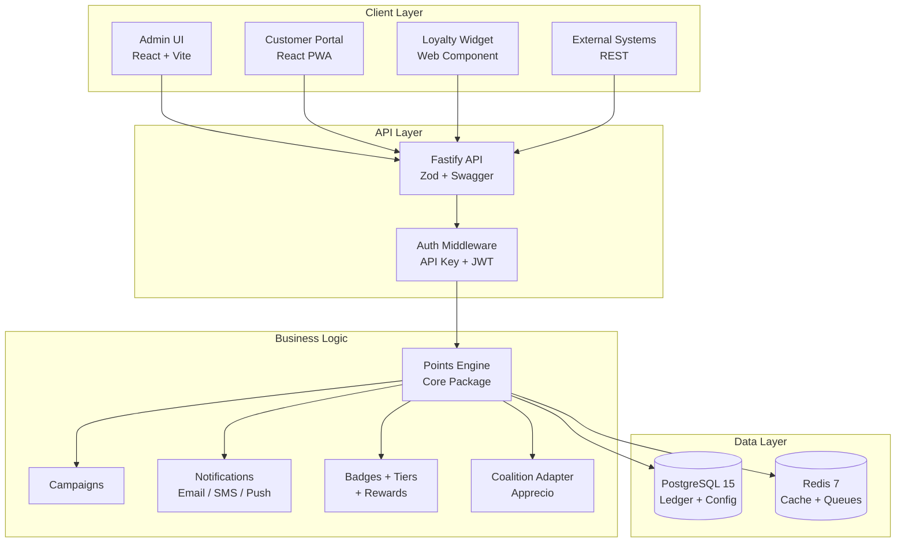

# LoyaltyOS

> The only open source loyalty platform with **native coalition support** — run your own points program while connecting to external coalition networks like Puntos Apprecio. MIT licensed.


**LoyaltyOS** is a modular, API-first loyalty platform built for teams that want full control over their points program. Run campaigns, issue coupons, manage tiers and badges, and integrate with coalition point systems — all from a single Dockerized stack.

## Why LoyaltyOS?

Most loyalty platforms lock you into a single points ecosystem. LoyaltyOS is the first open source platform that lets you run **dual points programs**: your own proprietary points alongside external coalition points (like Puntos Apprecio across Mexico, Chile, Colombia, Peru, and Ecuador). The coalition adapter is pluggable — swap Apprecio for any provider by implementing a single interface.

- **100% open source** — MIT licensed, no enterprise tier paywalls.
- **Coalition-native** — dual points engine: proprietary + external coalition (Apprecio included).
- **Self-hosted** — runs on your own infrastructure with Docker or Kubernetes.
- **Privacy-first** — magic-link auth, no passwords stored, soft-delete, GDPR-ready isolation.

## Features

### Core Platform

- **Points Engine** — immutable ledger with accumulate, redeem, expire, adjust, and reverse operations. Idempotency-key support for safe retries. Rule-based multipliers and pending/confirmed balance tracking.
- **Multi-tenant** — multiple programs under a single installation, scoped via `X-API-Key` + `X-Program-Id` headers.
- **REST API** — Fastify 4 with Zod validation, Swagger docs at `/docs`, rate limiting, CORS, and Helmet security headers.
- **Admin Dashboard** — React 18 + Vite + shadcn/ui + TanStack Query. KPI cards, member management, campaign builder (6-step wizard), segment builder, coupon generator, badges/tiers editor, rewards catalog, and coalition configuration.
- **Magic-Link Auth** — passwordless login via email. No passwords stored or transmitted. Session cookies with httpOnly, secure, sameSite strict.

### Engagement

- **Campaigns** — 8 types (Bonus Points, Spend & Get, Frequency, Milestone, Referral, Birthday, Anniversary, Flash Sale, Tier Upgrade Bonus). Budget capping, stacking rules, A/B testing, impact estimation.
- **Coupons** — 6 discount types, 3 modes (Shared, Individual, Limited), bulk generation, usage tracking.
- **Segments** — dynamic rule DSL with AND/OR groups, visual builder, real-time member count estimation.
- **Notifications** — multi-channel (Email, SMS, Push, In-App, Webhook) with Handlebars templates, provider abstraction, and opt-out preferences.

### Gamification

- **Badges** — 5 types (Achievement, Status, Temporal, Collectible, Social) with condition DSL, progress tracking, event-driven auto-evaluation.
- **Tiers** — configurable rank hierarchy with threshold-based upgrades, inactivity downgrades, pyramid visualization.
- **Rewards** — 6 categories (Discount, Physical Product, Gift Card, Experience, Charity, Coalition Transfer), eligibility checks, stock management, idempotent redemption.
- **Customer Portal** — React PWA with magic-link auth, i18n (en/es), rewards catalog with wishlist, badges gallery, transaction history, notification preferences.
- **Loyalty Widget** — embeddable Lit Web Component with mini/full modes, themeable via CSS custom properties, ~45 KB gzipped.

### Coalition

- **Generic Adapter Interface** — pluggable provider implementations with capability flags.
- **Apprecio Adapter** — full implementation against real API, multi-country support (MX, CL, PE, CO, EC).
- **Two-Phase Commit** — PENDING → CONFIRMED/FAILED for all external operations. Compensation reversal on core failure.
- **Circuit Breaker + Retry** — opossum-based breaker with exponential backoff, transient error retries.
- **Credential Encryption** — AES-256-GCM at rest for coalition provider credentials.

### Production

- **Helm Chart** — 33 K8s resources with Bitnami PostgreSQL/Redis sub-charts, HPA v2, ingress with cert-manager, migrations Job, ServiceMonitor for Prometheus, PDB, NetworkPolicy, External Secrets Operator support.
- **Observability** — OpenTelemetry tracing, Prometheus metrics, Grafana dashboards (API Overview, BullMQ Queues).
- **Standalone Worker** — BullMQ worker entry point for independent K8s scaling.
- **CI/CD** — GitHub Actions: CI (typecheck, lint, test), Docker (build + push to GHCR), Docs (Docusaurus deploy to GitHub Pages).

## Architecture



## Quick Start

```bash
git clone https://github.com/jvillatox/loyaltyos.git && cd loyaltyos && pnpm install && docker compose up -d && pnpm dev
```

One command. Five services. Zero configuration. See the [documentation site](https://jvillatox.github.io/loyaltyos/) for detailed setup guides.

### Prerequisites

- **Node.js** >= 20
- **pnpm** >= 9
- **Docker** + Docker Compose

### Step-by-step

```bash
# 1. Clone and install
git clone https://github.com/jvillatox/loyaltyos.git
cd loyaltyos
pnpm install

# 2. Start infrastructure (PostgreSQL 15, Redis 7, MailHog, Adminer)
docker compose up -d

# 3. Set up the database
cp apps/api/.env.example apps/api/.env
pnpm --filter @loyaltyos/api db:reset
pnpm --filter @loyaltyos/api db:seed

# 4. Start the apps
pnpm dev
```

| App             | URL                        |
| --------------- | -------------------------- |
| Admin UI        | http://localhost:5173      |
| Customer Portal | http://localhost:5174      |
| REST API        | http://localhost:3002      |
| Swagger         | http://localhost:3002/docs |
| Adminer         | http://localhost:8080      |
| MailHog         | http://localhost:8025      |

### Demo credentials

The seed script creates a demo program with:

- **API Key:** `dev-key`
- **Program ID:** `prog_dev`
- **Admin User:** `admin@loyaltyos.dev`

```bash
# Test the API
curl http://localhost:3002/api/v1/stats/dashboard \
  -H "X-API-Key: dev-key" \
  -H "X-Program-Id: prog_dev"
```

## Deploy to Production

### Docker

Production Docker Compose stack with API, Admin, Portal, PostgreSQL, Redis, BullMQ worker, Prometheus, and OTEL Collector:

```bash
cp infra/docker/.env.production.example infra/docker/.env.production
# Edit with your production values
docker compose -f infra/docker/docker-compose.prod.yml up -d
```

### Kubernetes (Helm)

```bash
helm repo add bitnami https://charts.bitnami.com/bitnami
helm dependency build infra/k8s/helm/loyaltyos
helm install loyaltyos infra/k8s/helm/loyaltyos \
  --set api.image.tag=v1.0.0 \
  --set admin.image.tag=v1.0.0 \
  --set portal.image.tag=v1.0.0
```

Includes: PostgreSQL 16 (Bitnami), Redis 7 (Bitnami), HPA v2 (CPU + memory), ingress with nginx + cert-manager, migrations Job, ServiceMonitor for Prometheus, PDB, NetworkPolicy, and External Secrets Operator support.

## Coalition Spotlight: Puntos Apprecio

LoyaltyOS ships with a production-ready adapter for **Puntos Apprecio**, the largest coalition loyalty network in Latin America.

| Country  | Supported |
| -------- | --------- |
| Mexico   | Yes       |
| Chile    | Yes       |
| Peru     | Yes       |
| Colombia | Yes       |
| Ecuador  | Yes       |

**How it works:**

1. A customer shops at your store (LoyaltyOS program) and earns your proprietary points **plus** Puntos Apprecio.
2. A customer redeems Puntos Apprecio at your store — LoyaltyOS validates the balance via the Apprecio API, processes the discount, and confirms the debit.
3. A customer converts your proprietary points into Puntos Apprecio — LoyaltyOS debits your ledger and credits Apprecio via API.

All cross-system operations use **two-phase commit** (PENDING → CONFIRMED/FAILED) with a circuit breaker and exponential backoff. Credentials are encrypted with AES-256-GCM at rest. See the [Coalition docs](docs/coalition.md) for details.

## Differentiators vs OpenLoyalty.io

| Feature                   | OpenLoyalty     | LoyaltyOS                |
| ------------------------- | --------------- | ------------------------ |
| Open Source               | Yes (limited)   | MIT (full)               |
| Native Coalition          | No              | Yes (Apprecio + generic) |
| Setup                     | Complex         | Docker one-liner         |
| Embeddable Widget         | No              | Yes (Lit Web Component)  |
| A/B Testing for Campaigns | No              | Yes                      |
| Customer Portal (PWA)     | No              | Yes                      |
| Multi-tenant              | Enterprise only | Included                 |
| Visual Segment Builder    | Basic           | Advanced                 |
| Magic-Link Auth           | No              | Yes (passwordless)       |
| Helm Chart                | No              | Yes (33 K8s resources)   |
| OpenTelemetry Tracing     | No              | Yes                      |
| Circuit Breaker           | No              | Yes (built-in)           |

## Project Structure

```
loyaltyos/
├── apps/
│   ├── api/                 # REST API (Fastify 4 + Prisma + Zod)
│   ├── admin/               # Admin Dashboard (React 18 + Vite + shadcn/ui)
│   ├── portal/              # Customer Portal (React PWA + i18next)
│   └── widget/              # Loyalty Widget (Lit Web Components)
├── packages/
│   ├── core/                # Points engine — immutable ledger, accumulate, redeem, adjust
│   ├── campaigns/           # Campaign rules engine (8 types, A/B testing)
│   ├── coupons/             # Coupon system (6 discount types, bulk generation)
│   ├── segments/            # Dynamic segments DSL with rule evaluator
│   ├── badges/              # Badges engine + tiers (5 types, condition DSL)
│   ├── rewards/             # Rewards catalog with eligibility, stock, redemption
│   ├── notifications/       # Multi-channel notifications (Email, SMS, Push, In-App, Webhook)
│   ├── coalition/           # Coalition adapter (Apprecio + generic interface)
│   ├── telemetry/           # OpenTelemetry tracing + Prometheus metrics
│   ├── config-eslint/       # Shared ESLint configuration
│   └── config-prettier/     # Shared Prettier configuration
├── infra/
│   ├── docker/              # Production Docker Compose + monitoring
│   ├── k8s/                 # Helm chart (33 resources, PostgreSQL, Redis, HPA)
│   └── grafana/             # Grafana dashboards (API Overview, BullMQ Queues)
├── docs/                    # Architecture, guides, data model reference
├── docs-site/               # Docusaurus documentation site
├── docker-compose.yml       # Local dev infrastructure (PG, Redis, MailHog, Adminer)
└── turbo.json               # Turborepo pipeline
```

## Tech Stack

| Layer         | Technology                                          |
| ------------- | --------------------------------------------------- |
| API           | Node.js 20, Fastify 4, TypeScript strict            |
| Database      | PostgreSQL 15, Prisma ORM                           |
| Cache / Queue | Redis 7, BullMQ                                     |
| Admin UI      | React 18, Vite, Tailwind, shadcn/ui, TanStack Query |
| Portal        | React 18, Vite, Tailwind, i18next, PWA              |
| Widget        | Lit 3, Web Components, ~45 KB bundle                |
| Auth          | Lucia Auth, magic-link (passwordless)               |
| Email         | Resend (default) + pluggable adapters               |
| Observability | OpenTelemetry, Prometheus, Grafana                  |
| Testing       | Vitest, Supertest                                   |
| CI/CD         | GitHub Actions                                      |
| Docs          | Docusaurus 3                                        |

## Commands

| Command                                | Description                    |
| -------------------------------------- | ------------------------------ |
| `pnpm install`                         | Install all dependencies       |
| `pnpm dev`                             | Start all apps in dev mode     |
| `pnpm build`                           | Build all packages and apps    |
| `pnpm test`                            | Run all tests                  |
| `pnpm typecheck`                       | Type-check the entire monorepo |
| `pnpm lint`                            | Lint all packages              |
| `pnpm format`                          | Format code with Prettier      |
| `pnpm --filter @loyaltyos/api db:seed` | Re-seed demo data              |

## API Overview

All endpoints require `X-API-Key` and `X-Program-Id` headers (except auth routes, which use session cookies).

| Method   | Endpoint                                 | Description                               |
| -------- | ---------------------------------------- | ----------------------------------------- |
| `GET`    | `/healthz`                               | Health check                              |
| `GET`    | `/readyz`                                | Readiness probe (DB check)                |
| `GET`    | `/api/v1/stats/dashboard`                | KPI aggregates                            |
| `GET`    | `/api/v1/members`                        | List members (paginated)                  |
| `POST`   | `/api/v1/members`                        | Create a member                           |
| `GET`    | `/api/v1/members/me`                     | Authenticated member profile              |
| `GET`    | `/api/v1/members/me/balance`             | Authenticated member balance              |
| `GET`    | `/api/v1/members/me/transactions`        | Authenticated member transaction history  |
| `GET`    | `/api/v1/members/me/badges`              | Authenticated member badges               |
| `GET`    | `/api/v1/members/me/tier`                | Authenticated member tier progress        |
| `GET`    | `/api/v1/members/:id`                    | Get member by ID                          |
| `GET`    | `/api/v1/members/:id/balance`            | Get member point balance                  |
| `GET`    | `/api/v1/members/:id/transactions`       | Get member transaction history            |
| `POST`   | `/api/v1/members/:id/adjust`             | Adjust points (requires Idempotency-Key)  |
| `POST`   | `/api/v1/events`                         | Ingest an event                           |
| `POST`   | `/api/v1/auth/magic-link`                | Request magic link                        |
| `POST`   | `/api/v1/auth/verify-magic-link`         | Verify magic-link token, create session   |
| `POST`   | `/api/v1/auth/logout`                    | Invalidate session                        |
| `GET`    | `/api/v1/auth/me`                        | Get authenticated member                  |
| `GET`    | `/api/v1/admin/campaigns`                | List campaigns (paginated)                |
| `POST`   | `/api/v1/admin/campaigns`                | Create a campaign                         |
| `POST`   | `/api/v1/admin/campaigns/estimate`       | Estimate campaign impact                  |
| `GET`    | `/api/v1/admin/coupons`                  | List coupons (paginated)                  |
| `POST`   | `/api/v1/admin/coupons/generate`         | Bulk generate coupon codes                |
| `GET`    | `/api/v1/admin/segments`                 | List segments (paginated)                 |
| `POST`   | `/api/v1/admin/segments`                 | Create a segment                          |
| `POST`   | `/api/v1/admin/segments/estimate`        | Estimate segment member count             |
| `GET`    | `/api/v1/admin/badges`                   | List badges (paginated, with type filter) |
| `POST`   | `/api/v1/admin/badges`                   | Create a badge                            |
| `GET`    | `/api/v1/admin/tiers`                    | List tiers (ordered by rank)              |
| `POST`   | `/api/v1/admin/tiers`                    | Create a tier                             |
| `PATCH`  | `/api/v1/admin/tiers/reorder`            | Reorder tier ranks                        |
| `GET`    | `/api/v1/admin/rewards`                  | List rewards (admin)                      |
| `POST`   | `/api/v1/admin/rewards`                  | Create a reward                           |
| `GET`    | `/api/v1/rewards`                        | List rewards (public catalog)             |
| `POST`   | `/api/v1/rewards/:id/redeem`             | Redeem a reward                           |
| `GET`    | `/api/v1/admin/notification-templates`   | List templates (paginated)                |
| `POST`   | `/api/v1/admin/notification-templates`   | Create a template                         |
| `POST`   | `/api/v1/admin/notifications/test-send`  | Test-send a notification                  |
| `GET`    | `/api/v1/admin/webhooks`                 | List webhooks (paginated)                 |
| `POST`   | `/api/v1/admin/webhooks`                 | Create a webhook subscription             |
| `POST`   | `/api/v1/coalition/accumulate`           | Accumulate coalition points               |
| `POST`   | `/api/v1/coalition/redeem`               | Redeem coalition points                   |
| `POST`   | `/api/v1/coalition/convert`              | Convert own points to coalition           |
| `POST`   | `/api/v1/coalition/reverse`              | Reverse a coalition transaction           |
| `GET`    | `/api/v1/coalition/:memberId/balance`    | Get member's external coalition balance   |
| `GET`    | `/api/v1/coalition/:memberId/history`    | Get member's external coalition history   |
| `GET`    | `/api/v1/admin/coalition/config`         | Get coalition configuration               |
| `PUT`    | `/api/v1/admin/coalition/config`         | Update coalition configuration            |
| `POST`   | `/api/v1/admin/coalition/healthcheck`    | Test coalition adapter connection         |
| `POST`   | `/api/v1/admin/coalition/link`           | Link member to external coalition account |
| `DELETE` | `/api/v1/admin/coalition/link/:memberId` | Unlink member from coalition account      |
| `GET`    | `/api/v1/admin/coalition/links`          | List linked coalition accounts            |
| `GET`    | `/api/v1/admin/coalition/transactions`   | List coalition transactions               |
| `POST`   | `/api/v1/admin/coalition/reconciliation` | Run coalition reconciliation              |

Full OpenAPI spec at `/docs` when the API is running.

## Design Principles

- **API-first** — everything the Admin UI does is available via REST.
- **Immutable ledger** — point transactions are never deleted. Reversals use contra-entries.
- **Idempotent** — critical operations require an `Idempotency-Key` header.
- **Multi-tenant** — program-scoped data isolation enforced at the API layer.
- **Event-driven** — business logic triggers from events (purchase, registration, etc.).
- **Modular** — each subsystem is an independent package that can be enabled or disabled.

## Roadmap

| Phase | Scope                                                          | Status   |
| ----- | -------------------------------------------------------------- | -------- |
| 1     | Core MVP — monorepo, points engine, REST API, Admin UI, Docker | Complete |
| 2     | Engagement — campaigns, coupons, notifications, segments       | Complete |
| 3     | Gamification — badges, tiers, rewards, customer portal, widget | Complete |
| 4     | Coalition — Apprecio adapter, coalition accounts, admin panel  | Complete |
| 5     | Production — Helm charts, OTel, Docusaurus, CI/CD, v1.0.0      | Complete |

### Post-v1.0 Extensions

- **GraphQL API** — full GraphQL layer alongside the REST API.
- **SDK Clients** — official client libraries for Node.js, Python, and PHP.
- **Plugin Marketplace** — community plugins for CRM sync (HubSpot, Salesforce), payment gateways, and analytics integrations.
- **Multi-language Admin** — i18n support for the admin dashboard.
- **Advanced Analytics** — cohort retention, LTV prediction, churn alerts.

Full details in [docs/SPEC.md](docs/SPEC.md).

## Documentation

Comprehensive docs at **[jvillatox.github.io/loyaltyos](https://jvillatox.github.io/loyaltyos/)** covering:

- Getting Started (intro, quick start, development setup, Docker)
- Core Concepts (architecture, data model, points engine, multi-tenancy)
- Packages (core, campaigns, coupons, segments, badges, rewards, notifications, coalition, telemetry)
- Deployment (Docker Compose, Kubernetes Helm, environment variables)
- API Reference (full REST API)
- Integrations (coalition/Apprecio, customer portal, loyalty widget)
- Community (changelog, contributing)

## Contributing

Contributions are welcome. This project uses:

- **TypeScript strict** — no `any` without justification.
- **Conventional commits** — `feat:`, `fix:`, `docs:`, `refactor:`, `test:`, `chore:`.
- **Pre-commit hooks** — Husky runs ESLint, Prettier, and commitlint on staged files.
- **Formatting** — Prettier with single quotes, trailing commas, and 100-char print width.

Before submitting a PR, make sure `pnpm typecheck` and `pnpm lint` pass cleanly.

See [CONTRIBUTING.md](CONTRIBUTING.md) for detailed guidelines and [SECURITY.md](SECURITY.md) for the security policy.

## Contributors

LoyaltyOS is maintained by [@jvillatox](https://github.com/jvillatox). Contributors are recognized in the [GitHub contributors graph](https://github.com/jvillatox/loyaltyos/graphs/contributors).

## Backers

If LoyaltyOS helps your business, consider [sponsoring the project](https://github.com/sponsors/jvillatox) to support ongoing development.

## License

MIT — see [LICENSE](LICENSE).
