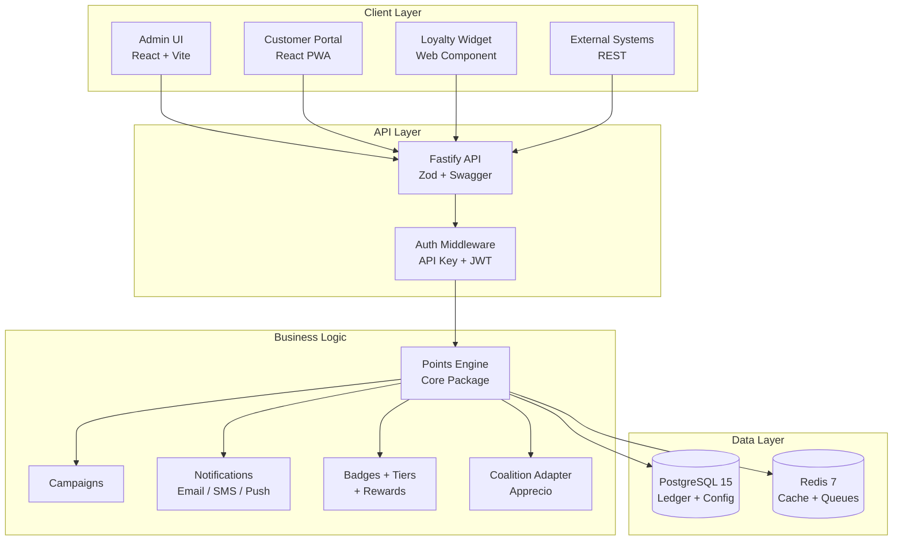

# LoyaltyOS

> Open source customer loyalty platform with native coalition support. MIT licensed.


**LoyaltyOS** is a modular, API-first loyalty platform designed to be simple to deploy but powerful in operation. Connect your sales channels, run campaigns, issue coupons, manage tiers and badges, and integrate with coalition point systems (Puntos Apprecio) — all from a single Dockerized stack.

## Features

- **Points Engine** — immutable ledger with earn, redeem, expire, and adjust operations. Idempotency-key support for safe retries.
- **Multi-tenant** — multiple programs under a single installation, scoped via API key + program ID headers.
- **Admin Dashboard** — React UI with KPI cards, member management, point balance, and transaction history.
- **REST API** — Fastify-based with Zod validation, Swagger docs, rate limiting, and CORS.
- **Tiers & Badges** — 5 badge types with condition DSL, rank tiers with progress tracking and pyramid visualization.
- **Rewards Catalog** — 6 categories, eligibility checks, stock management, and idempotent redemption.
- **Campaigns** — 8 types with budget capping, stacking rules, A/B testing, and impact estimation.
- **Coupons** — 6 discount types, 3 modes, bulk generation, usage tracking.
- **Segments** — dynamic rule builder with AND/OR conditions (eq, gt, contains, between) and static lists.
- **Notifications** — multi-channel delivery (email, SMS, push, in-app, webhook) with Handlebars templates.
- **Customer Portal** — mobile-first React PWA with magic-link auth, i18n, rewards catalog, badges gallery.
- **Loyalty Widget** — embeddable Lit Web Component with mini/full modes, themeable via CSS custom properties.
- **Coalition Points** — native integration with Apprecio and generic adapters, two-phase commit for safe cross-system earn/redeem/convert, circuit breaker with retry logic, credential encryption at rest.
- **Privacy-first** — soft-delete on members, GDPR-ready data isolation.

## Architecture



## Differentiators vs OpenLoyalty.io

| Feature                   | OpenLoyalty     | LoyaltyOS                |
| ------------------------- | --------------- | ------------------------ |
| Open Source               | Yes (limited)   | MIT (full)               |
| Native Coalition          | No              | Yes (Apprecio + generic) |
| Setup                     | Complex         | Docker one-liner         |
| Embeddable Widget         | No              | Yes (Web Component)      |
| A/B Testing for Campaigns | No              | Yes                      |
| Customer Portal (PWA)     | No              | Yes                      |
| Multi-tenant              | Enterprise only | Included                 |
| Visual Segment Builder    | Basic           | Advanced                 |

## Quick Start

### Prerequisites

- **Node.js** >= 20
- **pnpm** >= 9
- **Docker** + Docker Compose

### 1. Clone and install

```bash
git clone https://github.com/jaimevillatoro/loyaltyos.git
cd loyaltyos
pnpm install
```

### 2. Start infrastructure

```bash
docker compose up -d
```

Starts PostgreSQL 15, Redis 7, MailHog (SMTP testing), and Adminer (DB browser at :8080).

### 3. Set up the database

```bash
cp apps/api/.env.example apps/api/.env    # edit if needed
pnpm --filter @loyaltyos/api db:reset     # run migrations
pnpm --filter @loyaltyos/api db:seed      # seed demo data
```

### 4. Start the apps

```bash
pnpm dev
```

| App             | URL                        |
| --------------- | -------------------------- |
| Admin UI        | http://localhost:5173      |
| Customer Portal | http://localhost:5174      |
| REST API        | http://localhost:3002      |
| Swagger         | http://localhost:3002/docs |
| Adminer         | http://localhost:8080      |
| MailHog         | http://localhost:8025      |

### Demo credentials

The seed script creates a demo program with:

- **API Key:** `dev-key`
- **Program ID:** `prog_dev`
- **Admin User:** `admin@loyaltyos.dev`

### Test the API

```bash
# Dashboard stats
curl http://localhost:3002/api/v1/stats/dashboard \
  -H "X-API-Key: dev-key" \
  -H "X-Program-Id: prog_dev"

# Paginated member list
curl "http://localhost:3002/api/v1/members?page=1&pageSize=5" \
  -H "X-API-Key: dev-key" \
  -H "X-Program-Id: prog_dev"
```

## Project Structure

```
loyaltyos/
├── apps/
│   ├── api/                 # REST API (Fastify + Prisma + Zod)
│   ├── admin/               # Admin UI (React + Vite + shadcn/ui)
│   ├── portal/              # Customer Portal (React PWA + i18n)
│   └── widget/              # Embeddable loyalty widget (Lit Web Components)
├── packages/
│   ├── core/                # Points engine — accumulate, redeem, expire, adjust
│   ├── campaigns/           # Campaign rules engine (8 types, budgets, A/B testing)
│   ├── coupons/             # Coupon system (6 discount types, 3 modes, bulk ops)
│   ├── segments/            # Dynamic segments DSL with rule evaluator
│   ├── notifications/       # Multi-channel notifications with Handlebars templates
│   ├── badges/              # Badges engine + tiers (5 types, condition DSL, progress tracking)
│   ├── rewards/             # Reward catalog with eligibility, stock, and redemption
│   ├── coalition/           # Coalition adapter (Apprecio + generic)
│   └── config-eslint/       # Shared ESLint configuration
├── docker-compose.yml       # Local dev infrastructure
├── turbo.json               # Turborepo pipeline
└── docs/
    ├── SPEC.md              # Full architecture and roadmap
    ├── customer-portal.md   # Customer portal guide
    ├── widget-integration.md # Widget integration guide
    ├── notifications.md     # Notifications setup guide
    └── coalition-apprecio.md # Apprecio adapter guide
```

## Tech Stack

| Layer     | Technology                                          |
| --------- | --------------------------------------------------- |
| API       | Node.js 20, Fastify 4, TypeScript strict            |
| Database  | PostgreSQL 15, Prisma ORM                           |
| Cache     | Redis 7                                             |
| Admin UI  | React 18, Vite, Tailwind, shadcn/ui, TanStack Query |
| Portal    | React 18, Vite, Tailwind, i18next, PWA              |
| Widget    | Lit 3, Web Components, ~45 KB bundle                |
| Charts    | Recharts                                            |
| Dev Tools | Turborepo, ESLint, Prettier, Husky, commitlint      |
| Testing   | Vitest, Supertest                                   |
| Infra     | Docker Compose (Postgres, Redis, MailHog, Adminer)  |

## Commands

| Command                                | Description                    |
| -------------------------------------- | ------------------------------ |
| `pnpm install`                         | Install all dependencies       |
| `pnpm dev`                             | Start all apps in dev mode     |
| `pnpm build`                           | Build all packages and apps    |
| `pnpm test`                            | Run all tests                  |
| `pnpm typecheck`                       | Type-check the entire monorepo |
| `pnpm lint`                            | Lint all packages              |
| `pnpm format`                          | Format code with Prettier      |
| `pnpm --filter @loyaltyos/api db:seed` | Re-seed demo data              |

## API Overview

All endpoints require `X-API-Key` and `X-Program-Id` headers.

| Method   | Endpoint                                 | Description                               |
| -------- | ---------------------------------------- | ----------------------------------------- |
| `GET`    | `/healthz`                               | Health check                              |
| `GET`    | `/readyz`                                | Readiness probe (DB check)                |
| `GET`    | `/api/v1/stats/dashboard`                | KPI aggregates                            |
| `GET`    | `/api/v1/members`                        | List members (paginated)                  |
| `POST`   | `/api/v1/members`                        | Create a member                           |
| `GET`    | `/api/v1/members/:id`                    | Get member by ID                          |
| `GET`    | `/api/v1/members/:id/balance`            | Get member point balance                  |
| `GET`    | `/api/v1/members/:id/transactions`       | Get member transaction history            |
| `POST`   | `/api/v1/members/:id/adjust`             | Adjust points (requires Idempotency-Key)  |
| `POST`   | `/api/v1/events`                         | Ingest an event                           |
| `GET`    | `/api/v1/admin/campaigns`                | List campaigns (paginated)                |
| `POST`   | `/api/v1/admin/campaigns`                | Create a campaign                         |
| `POST`   | `/api/v1/admin/campaigns/estimate`       | Estimate campaign impact                  |
| `GET`    | `/api/v1/admin/coupons`                  | List coupons (paginated)                  |
| `POST`   | `/api/v1/admin/coupons/generate`         | Bulk generate coupon codes                |
| `GET`    | `/api/v1/admin/segments`                 | List segments (paginated)                 |
| `POST`   | `/api/v1/admin/segments`                 | Create a segment                          |
| `POST`   | `/api/v1/admin/segments/estimate`        | Estimate segment member count             |
| `GET`    | `/api/v1/admin/badges`                   | List badges (paginated, with type filter) |
| `POST`   | `/api/v1/admin/badges`                   | Create a badge                            |
| `GET`    | `/api/v1/admin/tiers`                    | List tiers (ordered by rank)              |
| `POST`   | `/api/v1/admin/tiers`                    | Create a tier                             |
| `PATCH`  | `/api/v1/admin/tiers/reorder`            | Reorder tier ranks                        |
| `GET`    | `/api/v1/rewards`                        | List rewards (paginated, with filters)    |
| `POST`   | `/api/v1/admin/rewards`                  | Create a reward                           |
| `POST`   | `/api/v1/rewards/:id/redeem`             | Redeem a reward                           |
| `POST`   | `/api/v1/auth/login`                     | Request magic link                        |
| `GET`    | `/api/v1/auth/verify`                    | Verify magic-link token                   |
| `GET`    | `/api/v1/admin/notification-templates`   | List templates (paginated)                |
| `POST`   | `/api/v1/admin/notification-templates`   | Create a template                         |
| `GET`    | `/api/v1/admin/webhooks`                 | List webhooks (paginated)                 |
| `POST`   | `/api/v1/admin/webhooks`                 | Create a webhook subscription             |
| `POST`   | `/api/v1/coalition/accumulate`           | Accumulate coalition points               |
| `POST`   | `/api/v1/coalition/redeem`               | Redeem coalition points                   |
| `POST`   | `/api/v1/coalition/convert`              | Convert own points to coalition           |
| `POST`   | `/api/v1/coalition/reverse`              | Reverse a coalition transaction           |
| `GET`    | `/api/v1/members/:id/coalition/balance`  | Get member's external coalition balance   |
| `GET`    | `/api/v1/members/:id/coalition/history`  | Get member's external coalition history   |
| `GET`    | `/api/v1/admin/coalition/config`         | Get coalition configuration               |
| `PUT`    | `/api/v1/admin/coalition/config`         | Update coalition configuration            |
| `POST`   | `/api/v1/admin/coalition/healthcheck`    | Test coalition adapter connection         |
| `POST`   | `/api/v1/admin/coalition/link`           | Link member to external coalition account |
| `DELETE` | `/api/v1/admin/coalition/link/:memberId` | Unlink member from coalition account      |
| `GET`    | `/api/v1/admin/coalition/links`          | List linked coalition accounts            |
| `GET`    | `/api/v1/admin/coalition/transactions`   | List coalition transactions               |
| `POST`   | `/api/v1/admin/coalition/reconciliation` | Run coalition reconciliation              |

Full OpenAPI spec at `/docs` when the API is running.

## Design Principles

- **API-first** — everything the Admin UI does is available via REST.
- **Immutable ledger** — point transactions are never deleted. Reversals use contra-entries.
- **Idempotent** — critical operations require an `Idempotency-Key` header.
- **Multi-tenant** — program-scoped data isolation enforced at the API layer.
- **Event-driven** — business logic triggers from events (purchase, registration, etc.).
- **Modular** — each subsystem is an independent package that can be enabled or disabled.

## Roadmap

| Phase | Scope                                                          | Status   |
| ----- | -------------------------------------------------------------- | -------- |
| 1     | Core MVP — monorepo, points engine, REST API, Admin UI, Docker | Complete |
| 2     | Engagement — campaigns, coupons, notifications, segments       | Complete |
| 3     | Gamification — badges, tiers, rewards, customer portal, widget | Complete |
| 4     | Coalition — Apprecio adapter, coalition accounts, admin panel  | Complete |
| 5     | Production — Helm charts, OTel, Docusaurus, CI/CD, v1.0.0      | Next     |

Full details in [docs/SPEC.md](docs/SPEC.md).

## Contributing

Contributions are welcome. This project uses:

- **TypeScript strict** — no `any` without justification.
- **Conventional commits** — `feat:`, `fix:`, `docs:`, `refactor:`, `test:`, `chore:`.
- **Pre-commit hooks** — Husky runs ESLint, Prettier, and commitlint on staged files.
- **Formatting** — Prettier with single quotes, trailing commas, and 100-char print width.

Before submitting a PR, make sure `pnpm typecheck` and `pnpm lint` pass cleanly.

See [CONTRIBUTING.md](CONTRIBUTING.md) for detailed guidelines and [CHANGELOG.md](CHANGELOG.md) for release history.

## License

MIT — see [LICENSE](LICENSE).
