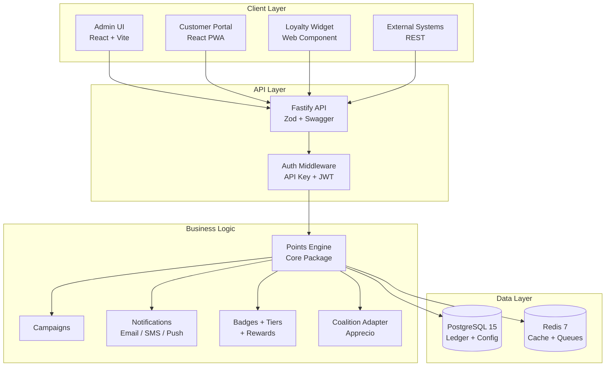

# Architecture

LoyaltyOS is a modular, API-first loyalty platform. This page describes the system architecture at a high level.

## System Overview

```
loyaltyos/
├── apps/
│   ├── api/              # REST API (Node.js / Fastify)
│   ├── admin/            # Admin UI (React + Vite)
│   ├── portal/           # Customer Portal (React PWA)
│   └── widget/           # Embeddable loyalty widget (Web Component)
├── packages/
│   ├── core/             # Points engine
│   ├── campaigns/        # Campaign engine
│   ├── segments/         # Customer segmentation
│   ├── coupons/          # Coupon management
│   ├── rewards/          # Rewards catalog
│   ├── badges/           # Badges and gamification
│   ├── coalition/        # Coalition connector
│   ├── notifications/    # Notification channels
│   └── telemetry/        # Observability (OTel + Prometheus)
├── infra/
│   ├── docker/           # Docker Compose configs
│   ├── k8s/              # Helm charts
│   └── grafana/          # Monitoring dashboards
└── docs-site/            # This documentation
```

## Data Flow



## Pillars of Design

1. **API-first** — Everything the Admin UI does is also available via REST.
2. **Modular** — Each subsystem (points, coupons, campaigns, badges) is an independent package that can be enabled or disabled.
3. **Coalition-ready** — Architecture prepared to connect with external points systems without breaking the local points engine.
4. **Multi-tenant** — Supports multiple brands/programs under a single installation.
5. **Event-driven** — Business logic triggers from events (purchase, registration, referral, birthday, etc.).

## Module Summary

### Points Engine (`packages/core`)

The heart of the system. Manages the complete lifecycle of program points:

- Accumulation of points by event (purchase, registration, referral)
- Multiplier rules (2x on weekends, 3x on premium categories)
- Configurable expiry (rolling or fixed date)
- Pending vs confirmed balances (for return flows)
- Immutable transaction ledger
- Multi-currency points (different units per program)

### Campaigns (`packages/campaigns`)

Incentive campaigns without writing code. Types: Bonus Points, Spend & Get, Frequency, Milestone, Referral, Birthday/Anniversary, Flash Sale, Tier Upgrade Bonus. Supports A/B testing via CampaignVariant records, budget capping, stacking rules, and impact estimation.

### Segments (`packages/segments`)

Dynamic or static member audiences. Rule DSL with AND/OR groups and operators (eq, neq, gt, gte, lt, lte, between, contains, in). Used to target campaigns and communications.

### Coupons (`packages/coupons`)

Discount codes with 3 modes (Shared, Individual, Limited) and 6 discount types (Percentage, Fixed, Free Product, Free Shipping, Extra Points, Experience). Bulk generation with usage tracking.

### Rewards (`packages/rewards`)

Catalog items members exchange points for. 6 categories, eligibility checks (points, tier, stock), stock management, idempotent redemption.

### Badges & Tiers (`packages/badges`)

5 badge types with condition DSL and progress tracking. Configurable rank hierarchy with threshold-based upgrades, inactivity downgrade, and tier benefits.

### Coalition (`packages/coalition`)

Pluggable adapter interface for external points systems. Built-in Apprecio adapter for Latin American coalition points. Two-phase commit, circuit breaker, retry logic, credential encryption at rest.

### Notifications (`packages/notifications`)

Multi-channel delivery (Email, SMS, Push, In-App, Webhook) with Handlebars templates, provider abstraction, and opt-out management.

### Telemetry (`packages/telemetry`)

OpenTelemetry tracing + Prometheus metrics. Zero overhead when disabled (dynamic imports). HTTP metrics, BullMQ queue metrics, default Node.js metrics.

## Differentiators vs OpenLoyalty.io

| Feature                   | OpenLoyalty     | LoyaltyOS                |
| ------------------------- | --------------- | ------------------------ |
| Open Source               | Yes (limited)   | MIT (full)               |
| Native Coalition          | No              | Yes (Apprecio + generic) |
| Setup                     | Complex         | Docker one-liner         |
| Embeddable Widget         | No              | Yes (Web Component)      |
| A/B Testing for Campaigns | No              | Yes                      |
| Customer Portal (PWA)     | No              | Yes                      |
| Multi-tenant              | Enterprise only | Included                 |
| Visual Segment Builder    | Basic           | Advanced                 |
